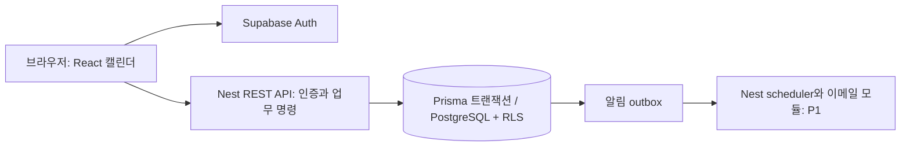

# Dayjoin 기술·데이터 설계

최신 범위(2026-09-26): 사용자 방향에 따라 계좌·카드·이체까지 포함한 가계부를 Dayjoin에 설계한다. 아래 기존 일정 모델에 금융 거래 금액 필드만 추가하는 방식으로 구현하지 않는다. [통합 가계부 설계안](13_CALENDAR_RECORDS_PROPOSAL.md)의 별도 개인 원장·계정·거래 명령과 캘린더 공개 조회 경계를 함께 따른다. 실제 업무 schema와 금융 모듈은 아직 없다.

최신 플랫폼 범위(2026-09-27): **React/Vite 기반 웹앱(PWA)**을 먼저 제공한다. 모바일/PC 브라우저와 홈 화면 설치를 대상으로 하며 Nest API/PostgreSQL을 공유한다. Capacitor 네이티브 구성은 별도 브랜치/PR에서 보류한다. [플랫폼 계획](15_APP_AND_WEB_PLAN.md)과 [PWA 구현](24_PWA_IMPLEMENTATION.md)을 따른다.


## 공통 기술 결정안

**백엔드는 TypeScript·NestJS를 기준으로 한다.** 사용자가 가장 많이 사용해본 기술이라는 확인을 반영한 계획 v0.3이다. React + Vite와 공식 CLI 중심 개발도 사용자 확정 사항이다. Python은 조금 사용해본 보조 언어로 두고 필요할 때 데이터 정리/분석 실험에 사용한다. Java·C# 학습은 이번 출시 계획에 포함하지 않는다. Prisma/PostgreSQL/선택적 Redis는 Dayjoin 기반에서 검증하며, 인증·호스팅은 후속 선택이다. 프로젝트별 실제 상태는 README와 검증 기록을 따른다.

| 계층 | 선택 | 이유와 사용 범위 |
|---|---|---|
| 언어·런타임 | TypeScript strict, Node 24 LTS, SQL | 익숙한 백엔드를 활용하고 웹도 같은 언어 사용. Node 지원 상태·호환 패치는 착수 때 고정 |
| API | NestJS, 기본 Express 어댑터, REST | Controller는 입출력, Service는 업무 규칙, Repository는 DB 접근을 담당 |
| 계약·입력 | Swagger/OpenAPI, DTO, ValidationPipe | 허용 필드와 문자열/날짜/금액 형식을 서버에서 검증. 내부 ORM 모델을 응답으로 직접 노출하지 않음 |
| 웹 | React + Vite + React Router | 로그인 후 사용하는 SPA. 첫 학습은 HTML/CSS, React 상태·폼·API 연결 |
| UI·폼 | Tailwind CSS, 필요한 shadcn/ui, React Hook Form + Zod | 폼과 오류 표시를 재사용. 서버 검증을 생략하는 근거로 쓰지 않음 |
| 서버 상태 | TanStack Query | Nest REST API 조회/캐시, 로그아웃·작업 공간 변경 때 캐시 제거 |
| DB·ORM | PostgreSQL + Prisma | 일반 CRUD와 트랜잭션. 잠금·RLS·CHECK·트리거는 필요한 SQL로 보완 |
| 관리형 DB·인증 | Supabase PostgreSQL + Auth | 초기 운영 추천. Supabase는 DB/인증 제공, 업무 API는 Nest가 담당 |
| 중요 쓰기 | Nest application service + DB 트랜잭션 | 권한·멱등키·원장·알림 기록을 같은 트랜잭션으로 검증/반영 |
| 외부 호출·예약 작업 | Nest 모듈 + DB outbox, 필요 시 @nestjs/schedule | 결제·이메일 비밀은 API 서버에만 보관. 초기 영속 작업 큐/별도 워커 없음. Redis는 선택적 캐시 profile |
| 정적 호스팅 | Cloudflare Workers Static Assets + Wrangler | Vite 빌드 파일과 SPA fallback 배포 |
| API 호스팅 | Render Docker Web Service 우선 검토 | 서버 운영 부담을 줄이는 후보. 외부 파일럿과 실제 운영의 인스턴스 조건을 구분 |
| 로컬 | pnpm workspace, Docker Compose PostgreSQL + 선택적 Redis | 서비스별 web/api와 로컬 DB 실행, 프로젝트/포트 분리. Auth 도입 때 공급자 로컬 환경 추가 |
| 테스트 | API: Vitest·Supertest, 웹: Vitest·Testing Library, E2E: Playwright | 실제 PostgreSQL에서 권한·원장·동시성·migration 검증 |
| 개발·자동화 | 서비스별 Git 저장소, GitHub Actions, Markdown 백로그 | 작은 PR과 재현 가능한 검증. GitHub Issues/Projects는 필요할 때 사용 |

인증 도입 시 브라우저는 Supabase Auth로 로그인하고 access token을 Nest API에 보낸다. **업무 데이터 조회와 변경은 모두 Nest를 통한다.** DB 비밀번호와 서버 비밀은 브라우저에 전달하지 않는다. 소개 페이지는 정적 HTML로 시작한다. 기본 Express 어댑터 선택은 [Nest 공식 안내](https://docs.nestjs.com/first-steps), Prisma 연결은 [Nest 가이드](https://docs.nestjs.com/recipes/prisma)를 참고한다.

### 대안과 학습 범위

- FastAPI/Django는 Python 중심 개발을 선택할 때 유효한 대안이다. 현재는 Nest 경험과 주 10시간 조건을 활용하는 쪽으로 결정한다. Python 서버를 의무적으로 함께 운영하지 않는다.
- Nest의 Fastify 어댑터는 실제 병목과 플러그인 호환성을 확인한 뒤 검토한다. 프레임워크 순위만으로 변경하지 않는다.
- Next.js는 소개 사이트의 검색 유입/서버 렌더링 요구가 커질 때 재검토한다. 현재 프론트 학습은 React/Vite에 집중한다.
- 세 서비스의 저장소·DB·Auth·배포는 독립이다. 현재 각 저장소 안에서 web/api를 pnpm workspace로 묶는다. Dayjoin의 스토어 앱 구성은 현재 보류한다. 서비스 간 SSO, 공유 운영 DB, 마이크로서비스, Kubernetes, Kafka는 첫 버전에 넣지 않는다.

### 예정 폴더 구조

```text
apps/
  web/src/
    app/                 # 라우터·레이아웃
    features/            # 도메인별 화면·폼·API 호출
    components/ui/
    lib/                 # API client, Auth client, 형식화
  api/src/
    modules/             # auth, users, 도메인 모듈
    common/              # guards, pipes, 오류 처리
    infrastructure/      # database, redis 등의 연결 provider
    health/
  api/prisma/            # schema와 migration 설정/기록
infra/                   # Compose 초기 개발 DB 역할 설정
compose.yaml             # PostgreSQL, 선택적 Redis/API profile
tests/e2e/
docs/
```

Prisma를 업무 스키마의 단일 migration 관리자로 쓴다. Supabase Auth 내부 스키마는 ORM 관리 대상에서 제외한다. RLS·CHECK·트리거 등 추가 SQL도 같은 migration 이력에서 관리한다. Prisma의 세대별 migration 형식/명령이 다를 수 있으므로, 착수 때 안정 버전과 공식 문서를 맞춰 **실제 경로·CLI·커넥션 방식**을 고정한다. 과거 튜토리얼의 명령을 그대로 운영에 적용하지 않는다. 첫 업무 스키마 구현 때 생성→빈 DB 적용→기존 DB 업그레이드→트랜잭션/잠금을 재현한다. 현재 연결 기반에는 업무 모델/migration/RLS가 없으며 이 검증은 후속 작업이다.

## 인증과 데이터 경계

1. 이메일/비밀번호와 이메일 확인·재설정을 기본으로 한다. 외부 초대 전 별도 SMTP/발신 도메인을 준비한다. 소셜 로그인은 필요성 확인 후 추가한다.
2. Nest Guard는 Supabase access token의 서명·issuer·audience·만료·subject를 JWKS/공식 검증 라이브러리로 검사한다. 키 회전을 지원하고 단순 decode를 인증으로 인정하지 않는다. 사용자 수정 가능 metadata를 역할 근거로 쓰지 않는다. [JWT 검증 안내](https://supabase.com/docs/guides/auth/jwts).
3. Guard가 인증한 사용자 ID와 요청한 작업 공간을 Service에 전달한다. 모든 읽기/쓰기에서 현재 DB 멤버십을 확인하고 객체가 해당 공간에 속하는지 검증한다. 금액·재고·권한 변경은 같은 트랜잭션에서 재확인한다.
4. 업무 테이블은 노출하지 않는 전용 schema에 두고 Data API 노출 목록에서 제외한다. 브라우저의 anon/authenticated 역할에는 업무 테이블 조회·DML·명령 함수 실행 권한을 주지 않는다. Supabase service_role 키를 Nest의 일반 DB 접근 권한 대용으로 쓰지 않는다.
5. API의 DB 계정은 비소유자·NOBYPASSRLS 최소 권한 계정으로 분리한다. 모든 업무 테이블에 RLS를 적용하며 테넌트 포함 FK/유일 제약을 병행한다. Prisma 연결만으로 사용자 RLS가 자동 적용된다고 가정하지 않는다.
6. 읽기와 쓰기는 트랜잭션 helper를 통해 실행한다. 검증된 actor/tenant 값을 transaction-local `set_config(..., true)`로 설정하고, 그 트랜잭션의 client로만 쿼리한다. RLS 정책은 해당 사용자와 현재 DB 멤버십을 검증하며 tenant 값만 신뢰하지 않는다. 초기 멤버십 조회와 조직 생성의 정책도 별도로 설계하고 정책 간 재귀를 시험한다. pool 재사용 후 다른 사용자 문맥이 남지 않는지 반드시 검증한다.
7. migration용 DB 소유자 계정은 배포 작업에서만 쓴다. P1 예약 작업은 대상 업무만 수행하는 별도 최소 권한 역할/정책으로 설계하고, 각 작업의 테넌트와 수신 자격을 재확인한다. 전 테이블 RLS 우회 계정을 일반 API에 공유하지 않는다.
8. 모든 `VITE_` 값은 공개 정보다. DB·메일·PG 비밀은 API/CI secret으로만 관리한다. 계정 전환 때 조회 캐시와 임시 데이터를 제거하고 민감 데이터를 service worker에 영구 캐시하지 않는다.

## API와 비동기 처리

REST 경로는 `/api/v1`로 시작하고 오류는 `code`, `message`, `field_errors`, `request_id`로 통일한다. 목록은 페이지 크기 제한을 두고 문서화한다. 클라이언트 DTO와 서버 DTO의 일치는 OpenAPI 계약 검증으로 확인한다. Prisma 타입을 프론트의 공개 계약으로 삼지 않는다.

outbox는 업무 변경과 같은 트랜잭션에 넣고 commit 후 처리한다. P1 Nest scheduler는 DB에서 due 작업을 짧게 잠금/claim하고 lease 만료 작업을 재시도한다. 배포 중 두 인스턴스가 겹쳐도 중복 실행을 억제해야 한다. 외부 호출은 트랜잭션 밖에서 실행하며 provider 멱등키·지수 backoff·시도 한도·실패 목록을 사용한다. 영구적인 exactly-once를 약속하지 않는다. 서버 재시작 후 밀린 작업을 찾으며, 정시 발송을 제공할 때는 항상 실행되는 API 인스턴스가 필요하다.

## 서비스 구조



월/목록 UI는 FullCalendar Standard의 필요한 기능만 사용한다. Premium resource/timeline은 도입하지 않는다. F-002에서 React 19.3.0과 peer 조건을 대조해 @fullcalendar/react 7.1.0 및 temporal-polyfill 1.0.1을 CLI로 고정 설치했다. 공개 day-cell hook으로 날짜별 기록과 키보드 버튼을 구성했으며 실제 설치·검증은 [React 구현 기록](16_REACT_UI_IMPLEMENTATION.md)을 따른다. 캘린더 자체를 처음부터 그리는 작업을 피하되 모바일 편집 폼과 접근성은 직접 확인한다. [라이선스](https://fullcalendar.io/license), [React 컴포넌트](https://fullcalendar.io/docs/react).

## 핵심 데이터

| 엔티티 | 핵심 필드 | 규칙 |
|---|---|---|
| workspaces | id, kind(personal/group), name | 개인/공유 경계의 기본 단위 |
| memberships | workspace_id, user_id, role, status | 한 작업 공간/사용자 유일, 마지막 owner 보호 |
| calendars | workspace_id, id, name, color, timezone | 기본 Asia/Seoul, 개인 캘린더 별도 공간 |
| events | workspace_id, calendar_id, id, title, timing, revision, creator | 캘린더와 workspace를 함께 검증 |
| invitations | token_hash, workspace_id, role, expires_at, used_at, revoked_at | 원문 토큰 저장/로그 금지, 단일 수락 링크 |
| event_changes | event_id, revision, actor_id, changed_fields, created_at | 내용 전체를 분석 로그로 보내지 않음 |
| notifications | workspace_id, recipient_id, event_id, revision, read_at | 받는 사람만 읽기/읽음 처리 |
| outbox(P1) | event_id, occurrence_key, recipient_id, channel, due_at, state | 전송 단위 유일 키, 재시도 상태 관리 |

events의 시간 표현은 두 형태 중 하나만 유효하게 하는 CHECK 제약을 둔다.

- 시각 일정: `starts_at`, `ends_at`은 timestamptz, 원래 IANA timezone을 별도 보존. 저장은 절대 시각, 표시는 사용자 선택 시간대다.
- 종일 일정: `start_date`, `end_date_exclusive`는 date. UTC 자정으로 변환하지 않는다. 9월 26일 하루는 종료가 9월 27일이다.
- 기간 조회는 시작만 비교하지 않고 겹침 조건으로 검사한다. 이전 달에 시작해 이번 달에 끝나는 일정도 나온다.
- `revision` 조건부 갱신으로 오래된 화면의 덮어쓰기를 차단한다. 저장 버튼을 여러 번 눌러도 command_id로 같은 생성 결과를 반환한다.

## 서버 명령과 계약

| Nest Service 명령 | 입력 예 | 서버 검증·결과 |
|---|---|---|
| create_workspace | name, kind, command_id | 사용자 확인, 기본 캘린더와 owner를 한 트랜잭션으로 생성 |
| issue_invitation | workspace_id, role, expiry | owner 확인, owner 초대 역할은 금지, 원문은 발급 순간만 반환 |
| accept_invitation | token, command_id | 로그인 사용자, 만료/회수/기사용 검사, 멤버십과 사용 처리 원자적 기록 |
| create_event | calendar_id, timing, title, command_id | editor 이상, 캘린더 경계·시간 검증, 변경/알림 함께 생성 |
| update_event | id, expected_revision, changes | 역할 재확인, revision 불일치이면 CONFLICT 반환 |
| delete_event | id, expected_revision | 허용 역할, 변경 알림 생성, 예약 리마인더 취소 |
| leave_workspace | workspace_id | 마지막 owner 보호, 멤버십 비활성화, 대기 알림 취소 |

오류 계약은 `code`, 사용자 메시지, field_errors, request_id로 통일한다. 내부 SQL 오류/토큰은 반환하지 않는다. 인앱 변경 알림은 첫 버전에 화면 재진입/명시적 새로고침으로 갱신하고, 필요하면 저빈도 polling을 추가한다. 실시간 동기화를 이미 제공하는 것처럼 표시하지 않는다.

## 반복 일정과 리마인더의 후속 설계

반복 일정은 매주 요일 + 종료일/횟수부터 지원한다. series에 현지 시작 시각·IANA timezone·규칙을 저장하고 occurrence는 규칙의 원래 회차 ID로 식별한다. 예외는 회차 ID에 취소/대체 시각을 연결한다. “해당 회차”와 “전체” 수정만 먼저 제공하고 “이후 전체” 분할은 후속 범위다.

일정 자체는 조회 기간에 맞춰 전개하며 무한 반복을 전부 저장하지 않는다. 리마인더는 다음 30일 범위의 대상만 생성한다. 서울뿐 아니라 DST가 있는 지역에서 현지 시각이 유지되는지 시험한다. 존재하지 않는 현지 시각은 오류로 안내하고, 중복되는 시각은 오프셋을 사용자가 확인하게 한다. 시간 계산은 선택한 시간대 라이브러리 한 곳으로 모으고 브라우저 Date의 임의 문자열 파싱을 피한다.

이메일 전송은 DB outbox를 짧게 claim한 뒤 외부 호출한다. provider idempotency와 DB 유일 키로 재시도 중 중복을 억제한다. 네트워크 경계에서 절대적인 exactly-once 전송을 약속하지 않는다. 발송 직전 현재 멤버십·일정 상태·리마인더 버전을 재확인한다. 일정 변경/삭제 시 이전 작업을 무효화한다.

P1 수용 시험: 서울/토론토 주간 반복, DST 전환, 종일 일정, 예외 한 건 취소, 전체 종료일 변경, 발송 직후 응답 유실, 탈퇴 후 대기 메일 차단.

## 구현 기준 v0.3

설치 버전·공식 조건·프로젝트 선택·CLI 원칙은 [공식 문서 기반 개발 기준](08_ENGINEERING_STANDARD.md)을 적용한다. 표의 UI/Auth/호스팅 및 도메인 설계는 설치 완료 목록이 아니다.
