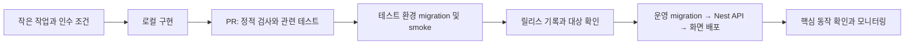

# DevOps·보안·운영 계획

상태: 로컬 기반 및 CI workflow 파일 작성. GitHub에서 CI 실행, 클라우드/도메인/모니터링 연결은 아직 하지 않았다. 주 10시간 운영자가 직접 재현할 수 있는 절차를 우선한다.

## 환경과 저장소

| 환경 | 구성 | 데이터와 접근 |
|---|---|---|
| local | 로컬 React + Nest API + Compose PostgreSQL/선택적 Redis | 가상 사용자/seed만 사용, 실제 고객 데이터 복사 금지 |
| CI | Nest 테스트 앱 + 임시 PostgreSQL/Redis; 제품 E2E는 후속 추가 | 테스트마다 초기화, 운영 secret 없음 |
| preview | 정적 미리보기 + 테스트 전용 Nest API | 유효한 테스트 backend가 없으면 mock 화면으로 표시. 운영 DB에 연결 금지 |
| staging | 서비스별 별도 Nest API + Supabase 프로젝트 권장 | 유료 베타 전 준비, 가상 데이터. 예산상 부재 시 동일 스택 로컬 검증으로 대체한 한계를 릴리스 기록에 명시 |
| production | 서비스별 Render Nest API + Supabase + Cloudflare 정적 배포 | API/DB를 가깝게 배치, 별도 Auth redirect·키·SMTP 설정 |

Render API와 Supabase DB는 Singapore 조합을 첫 후보로 두고 한국 접속 지연을 측정한다. Render는 현재 Seoul 리전을 제공하지 않으므로 한국 DB에 원거리 API를 연결하는 구성을 기본으로 삼지 않는다. 국내 리전이 필수이면 API 공급자부터 재선정한다. 인증·이메일·로그·지원의 처리 경로도 확인한다. [Render 리전](https://render.com/docs/regions), [Supabase 리전](https://supabase.com/docs/guides/platform/regions). 세 서비스는 같은 조직 계정으로 비용을 묶을 수 있지만 DB/Auth/secret/백업/배포 대상은 분리한다. 백업 파일은 별도 저장 위치와 접근 권한으로 관리한다.

`main`은 배포 가능한 상태로 유지하고 짧은 기능 브랜치→작은 PR→검증→병합을 따른다. 1인 개발이므로 다른 사람이 승인해야 한다고 가정하지 않는다. 비공개 저장소 보호 규칙의 지원 여부는 실제 GitHub 플랜에서 확인하고, 지원하지 않으면 로컬 PR 체크리스트와 릴리스 워크플로로 보완한다. `docs/` 수정만 있는 PR에 전체 브라우저 테스트를 강제하지 않는다.

## 개발·검증·배포 흐름

실제 명령은 README에 기록했다: lint, typecheck, test, test:e2e(HTTP 계약), test:integration(실제 PostgreSQL/선택적 Redis), build. 현재 UI 테스트·로그인 E2E·RLS/업무 migration 검증은 미구현이다.

| 검사 | 실행 시점 | 실패 시 조치 |
|---|---|---|
| 포맷·lint·타입·빌드 | 코드 PR | 수정 전 병합하지 않음 |
| 도메인 단위 테스트 | 계산/상태 변경 PR | 경계값·실패 사례 수정 |
| Nest API + 실제 DB/RLS 통합 | Service/SQL/권한 PR, 릴리스 | JWT 위조/만료, 탈퇴, 타 테넌트, DB context 누수, 부분 커밋 여부 확인 |
| migration 재현 | 스키마 PR | 빈 DB 설치 + 이전 릴리스 DB 업그레이드 모두 검증 |
| 핵심 E2E | 사용자 흐름 PR, 릴리스 | 로그인과 핵심 쓰기/조회 흐름 검증 |
| secret·의존성 검사 | PR/정기 점검 | 노출 키 회수, 위험 의존성 평가; 도구 경고를 자동 무시하지 않음 |
| 접근성·모바일 | 주요 화면 릴리스 | 키보드·레이블·명암·확대·터치 오류 해결 |

GitHub Actions는 Linux runner, pnpm cache, 중복 실행 취소, 짧은 artifact 보관으로 제한한다. 비공개 저장소 CI 사용량은 계정 무료 한도에서 함께 계산되므로 무제한 무료로 가정하지 않는다. [과금 근거](https://docs.github.com/en/billing/concepts/product-billing/github-actions). 외부 PR에 배포 secret을 전달하지 않는다. 외부 Action은 검토한 버전/commit으로 고정한다.

## Nest 서버와 배포 구성

- 다단계 Docker build로 API를 빌드하고 비루트 사용자로 실행한다. Node 버전·pnpm·lockfile을 고정한다. 로컬 업로드 디스크에 고객 파일을 영구 저장하지 않는다.
- CI는 web 정적 artifact와 API container image를 별도로 만든다. 통과한 commit/image digest를 배포하며 공급자 자동 배포와 Actions가 중복 배포하지 않게 한 경로만 쓴다.
- `/api/v1/health/live`는 프로세스, `/api/v1/health/ready`는 DB 접근 등 준비 상태를 확인한다. 내부 정보는 응답하지 않는다. 종료 신호 때 새 요청을 줄이고 진행 중 요청/트랜잭션을 마친 뒤 DB pool을 닫는다. [Nest Terminus](https://docs.nestjs.com/recipes/terminus).
- API runtime용 `DATABASE_URL`과 migration 전용 연결 secret을 분리한다. TLS 인증서를 검증하고 선택한 Supabase 연결 방식과 Prisma 버전의 pooling 호환성을 확인한다. 인스턴스 수 × pool 크기가 DB 한도를 넘지 않게 제한한다.
- CORS는 web origin allowlist, 인증/초대/내보내기는 요청 한도, 입력 body는 크기 제한을 둔다. 인증은 bearer access token 검증으로 시작하며 쿠키 인증을 도입하면 CSRF 정책도 함께 설계한다.
- GitHub Actions의 한 release job에서 migration을 1회 적용→이전 web과 호환되는 API 배포→health/smoke→web 배포 순서로 진행한다. 앱 인스턴스마다 시작 시 migration을 실행하지 않는다.
- Render Free의 idle 중지는 공개 데모에만 허용한다. 정시 알림/결제 갱신과 실제 고객 운영은 항상 실행되는 유료 인스턴스를 전제로 한다. [무료 인스턴스 제약](https://render.com/docs/free).

## DB 변경과 롤백

1. Prisma를 업무 schema migration의 단일 관리자로 쓴다. RLS/제약 SQL도 같은 이력에 넣고 운영 dashboard 수동 변경을 피한다. 운영 `reset`은 금지한다.
2. 컬럼 추가→구/신 코드 호환→데이터 backfill→전환→이전 컬럼 제거 순서로 나눈다.
3. 긴 backfill은 작은 묶음과 재시도 가능 작업으로 처리한다. lock 시간과 SQL 실행계획을 확인한다.
4. 배포 대상 project ref·commit·migration 목록을 기록한 뒤 순서대로 한 번만 적용한다. 환경별 동시 배포를 막는다.
5. API와 화면은 각각 이전 artifact로 되돌릴 수 있어도 DB는 자동으로 되돌리지 않는다. 호환 가능한 API/화면 복귀 또는 전진 수정이 기본이다. 데이터 손실 복구는 별도 복원 절차로 실행한다.
6. 새로고침·로그인·핵심 생성/조회와 에러율을 확인하고 실패 시 새 쓰기를 제한한다. 배포 성공 상태만으로 릴리스를 완료 처리하지 않는다.

## 백업·복원·사고 대응

- 로컬: 소스는 Git, 개발 DB는 seed로 재생성한다. 개인 실사용 데이터를 로컬에 넣는 순간부터 별도 암호화 백업을 준비한다.
- 무료 클라우드 파일럿: 일일 DB dump를 별도 위치에 암호화 보관하고 매일 성공 여부를 확인하는 작업을 구현한다. 실패를 조용히 넘기지 않는다. 무료 공급자 백업을 복구 수단으로 약속하지 않는다.
- 유료: 관리형 일일 DB 백업 + 독립 내보내기 + 월 1회 복원 연습. Storage 파일은 DB 백업에 포함되지 않으므로 첨부 기능 추가 때 별도 파일 백업을 함께 구축한다. [공급자 백업 설명](https://supabase.com/docs/guides/platform/backups).
- 출시 목표: RPO 24시간 이내, RTO 8시간 이내를 **목표**로 설정하고 첫 복원 연습 결과로 수정한다. 24시간 손실을 수용할 수 없는 ERP 고객은 PITR/더 촘촘한 백업 예산을 정하기 전 운영 데이터 이전을 진행하지 않는다.
- 복원 연습: 격리 DB에 복구→사용자/권한→행 수→도메인 합계→첨부 참조→핵심 흐름 확인. 실제 복원 시간·데이터 기준 시각을 기록한다. DB 덤프만으로 Auth 설정·비밀·외부 파일이 전부 복구된다고 가정하지 않는다.
- 사고 순서: 신규 쓰기/관련 기능 제한→영향 범위와 발생 시각 기록→키 노출 시 회수→백업 보존→수정/복원→무결성 검사→영향 사용자 안내→재발 방지 작업. 사용자 안내는 실제 발생 사실과 확인된 영향만 포함한다.

## 개인정보와 운영 보안

한국어/원화/KST가 기본이다. 개인정보 처리방침·이용약관·탈퇴/삭제·보유 기간·수탁자 및 국외 처리 경로·유료 환불 정책은 출시 전 실제 사업자와 공급자 구성에 맞춰 검토한다. 이 문서는 법률 검토 결과가 아니다. MVP는 성인 계정으로 시험하며 아동 직접 가입이 필요한 경우 범위와 절차를 별도로 설계한다.

비밀번호는 Auth 공급자가 관리한다. 카드번호·CVC는 저장하지 않는다. HTTPS, CSP 등 보안 헤더, 허용 origin, 안전한 redirect allowlist를 적용한다. UI의 HTML 삽입을 제한하고 사용자 텍스트를 escape한다. 초대/인증/내보내기에는 요청 한도와 악용 모니터링을 둔다. 관리자 계정 MFA, 최소 권한 토큰, 로컬 `.env` 제외, secret 회전 절차를 적용한다.

서버 로그에는 오류 코드·작업 ID·환경·소요시간만 우선 기록한다. 원문 일정 제목·거래 메모·연락처·access token·이메일 본문은 넣지 않는다. 오류 추적 도구를 추가하면 세션 녹화는 기본 끄고 PII 필터를 확인한다. 운영 지표는 내용이 아닌 이벤트명과 가명 식별자로 집계한다.

## 모니터링·운영 주기

| 신호 | 초기 경보 기준안 | 대응 |
|---|---|---|
| 핵심 작업 실패 | 10분 내 같은 실패 3회 또는 수동 확인 1회 | 최근 배포·DB·권한 확인 |
| API 메모리·DB/이메일/CI 한도 | 월 한도 50/80/100% | 80%에서 예측, 100% 전에 작업 제한/예산 조정 |
| 백업/예약 작업 | 예정 시각을 2회 연속 넘김 | 수동 확인, 실패 작업 재처리 |
| 권한 오류·비정상 요청 | 평소 대비 급증 | 토큰/초대 정책 확인, 필요한 경로만 제한 |

위 기준은 트래픽이 적은 초기 운영용 가설이다. 설정이 실제 작동하는지 테스트 경보로 검증한다. 매주 1시간 사용량·오류·사용자 문의 확인, 매월 복원/의존성/비용 검토 시간을 따로 확보한다. 주 10시간 가운데 운영 시간을 먼저 빼고 다음 개발 작업량을 정한다. 24시간 대응이나 SLA를 판매 조건으로 약속하지 않는다.

## Compose와 적용 단계

[공통 기준](08_ENGINEERING_STANDARD.md)의 로컬 전용 Compose·Redis profile·버전 고정 규칙을 적용한다. 아래 운영/보안 항목은 출시 전 계획이며 연결 기반만으로 완료하지 않는다.
